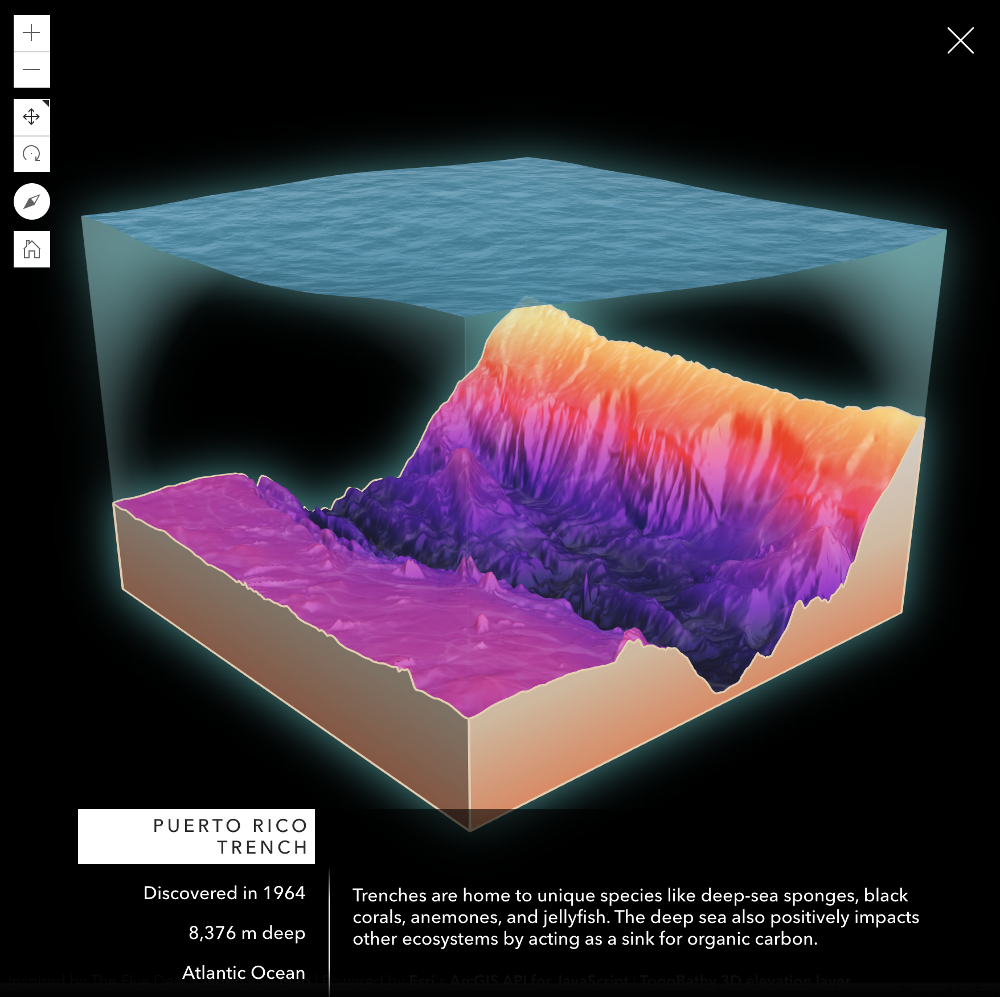

# Five deeps

A 3D interactive web map of the deepest points in each of the five oceans. Inspired by this awesome video: [The Five Deeps video](https://www.youtube.com/watch?v=tn4GJyuKBN8&ab_channel=Esri).

[](https://geoxc-apps4.bd.esri.com/five-deeps/)

[Live demo](https://geoxc-apps4.bd.esri.com/five-deeps/)

Diorama implemented by [Jesse van den Kieboom](https://github.com/jkieboom) and inspired by [John Nelson's work](https://www.youtube.com/watch?v=ehJhR3lgjNw&ab_channel=JohnNelson).



## Instructions

Clone this repository to your computer

```sh
git clone git@github.com:RalucaNicola/five-deeps.git
```

Install dependencies:

```sh
npm install
```

## Running the app

Now you can start the vite development server to test the app on your local machine:

```sh
npm run start
```

Open http://localhost:3000.

## Deployment

To build/deploy the app, you can simply run:

```sh
# it will place all files needed for deployment into the /dist directory
npm run build
```

## Licensing

Licensed under the Apache License, Version 2.0 (the "License");
you may not use this file except in compliance with the License.
You may obtain a copy of the License at

http://www.apache.org/licenses/LICENSE-2.0

Unless required by applicable law or agreed to in writing, software
distributed under the License is distributed on an "AS IS" BASIS,
WITHOUT WARRANTIES OR CONDITIONS OF ANY KIND, either express or implied.
See the License for the specific language governing permissions and
limitations under the License.

A copy of the license is available in the repository's [license.txt](license.txt) file.
